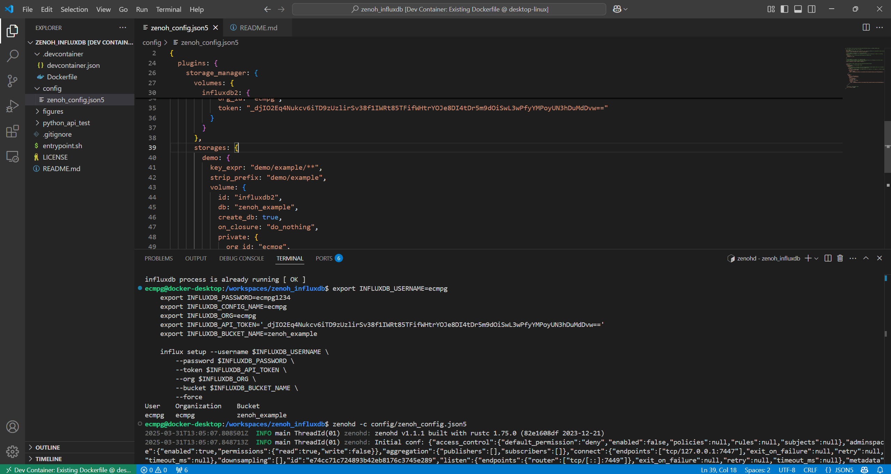
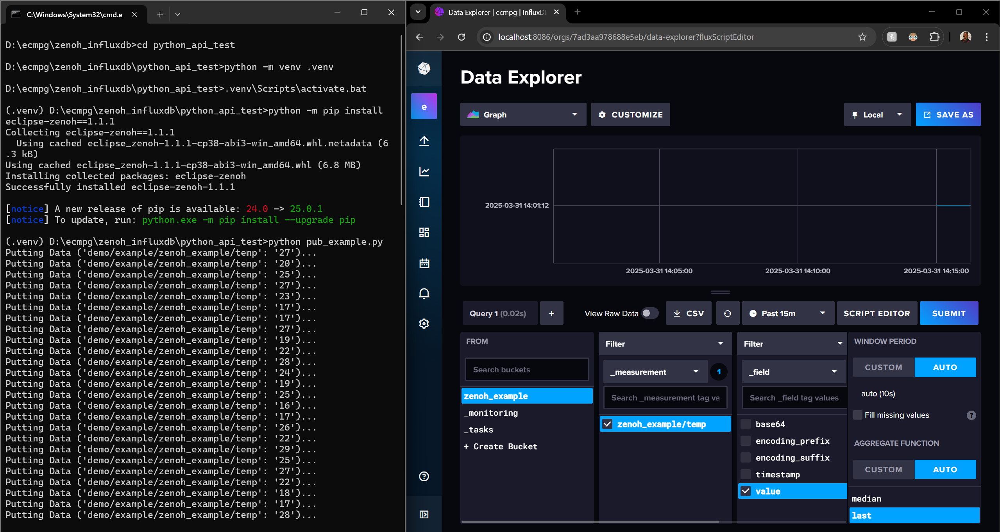

# Setup for Zenoh, InfluxDB, and Telegraf communication
Sample Pub Sub of sensor data to InfluxDB and Telegraf stack using Zenoh Python API, C/C++, TS, Rust APIs will have similar setups

## Requirements
- [Docker] (https://docs.docker.com/get-started/get-docker/)
- [Visual Studio Code](https://code.visualstudio.com/)
- [Remote Development extension pack](https://marketplace.visualstudio.com/items?itemName=ms-vscode-remote.vscode-remote-extensionpack) in Visual Studio Code Marketplace.

## Getting Started

1. Clone the repository and open in VS Code
    ```sh
    git clone https://github.com/MasterpieceNKA/dockered_moveit2.git
    code zenoh_influxdb_telegraf
    ```

2. Reopen in Container

    https://github.com/user-attachments/assets/8d09056a-3790-4e9a-9226-dc3e4273d62a


3. Open new terminal in the Devcontainer and setup InfluxDB. NB if you edit the token then remember to copy the new token value to lines 30 and 50 of ```config\zenoh_config.json5```.
    ```sh
    export INFLUXDB_USERNAME=ecmpg
    export INFLUXDB_PASSWORD=ecmpg1234
    export INFLUXDB_CONFIG_NAME=ecmpg
    export INFLUXDB_ORG=ecmpg
    export INFLUXDB_API_TOKEN='_djIO2Eq4Nukcv6iTD9zUzlirSv38f1IWRt85TFifWHtrYOJe8DI4tDr5m9dOiSwL3wPfyYMPoyUN3hDuMdDvw=='
    export INFLUXDB_BUCKET_NAME=zenoh_example

    influx setup --username $INFLUXDB_USERNAME \
        --password $INFLUXDB_PASSWORD \
        --token $INFLUXDB_API_TOKEN \
        --org $INFLUXDB_ORG \
        --bucket $INFLUXDB_BUCKET_NAME \
        --force
    ```

4. Run Zenoh router on from the Devcontainer terminal
    ```sh
    zenohd -c config/zenoh_config.json5
    ```


5. Setup and activate Python environment on host PC and install Zenoh Python API.
    ```bat
    cd python_api_test
    python -m venv .venv
    .venv\Scripts\activate.bat
    python -m pip install eclipse-zenoh==1.1.1
    ```
6. Run Python script from host PC terminal to send fake sensor data to InfluxDB.
    ```bat
    python pub_example.py
    ```
7. View data from InfluxDB by loging into http://localhost:8086/ with username and password contained in ```config\setup_influxdb.sh```.


